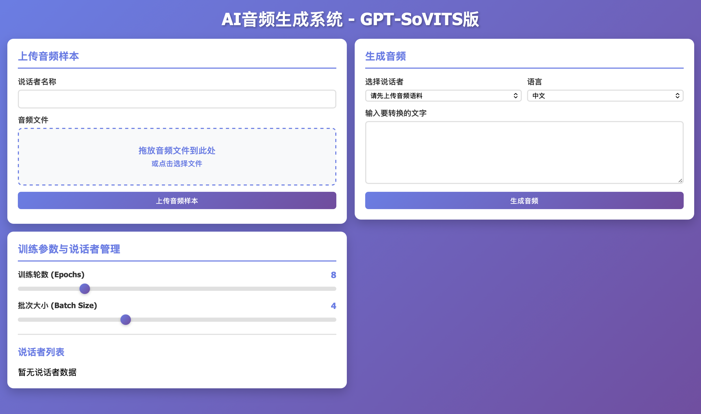

# AI 音频生成系统 - GPT-SoVITS

> 基于 GPT-SoVITS 的高质量声音克隆系统，支持多样本深度学习训练，实现高相似度的语音合成效果

[](https://www.python.org/downloads/)
[](https://github.com/RVC-Boss/GPT-SoVITS)
[](LICENSE)

---

## 核心特性

| 特性 | 说明 |
|------|------|
| **深度学习训练** | 从 5-20 个音频样本学习所有声音特征 |
| **完整训练流程** | Stage 1 (GPT) + Stage 2 (SoVITS) |
| **高质量生成** | 通过 API 生成自然流畅的语音 |
| **方言克隆** | 保留原音频的口音和方言特点 |
| **多语言支持** | 中文、英文、日语等 |
| **易于使用** | Web 界面 + RESTful API |

---

## 系统要求

### 硬件要求

| 组件 | 最低配置 | 推荐配置 |
|------|---------|---------|
| **CPU** | 4核心 | 8核心+ |
| **内存** | 8GB | 16GB+ |
| **GPU** | 6GB 显存 | RTX 3060 / 8GB+ |
| **存储** | 20GB | 50GB+ SSD |

### 软件要求

- **Python**: 3.12
- **CUDA**: 12.x
- **PyTorch**: 2.3.0
- **ffmpeg**: 8.0
- **操作系统**: Linux / macOS / Windows

---

## 快速开始

### 步骤 1：安装系统依赖和项目

**首先安装 ffmpeg（必需）：**

```bash
# Ubuntu / Debian
sudo apt-get update && sudo apt-get install -y ffmpeg

# macOS
brew install ffmpeg
```

**然后安装依赖：**

```bash
# 进入项目根目录
cd VoiceClone-Studio

# 创建虚拟环境并激活（推荐使用 Python 3.12）
python3.12 -m venv venv
source venv/bin/activate  # Windows: venv\Scripts\activate

# 升级 pip
pip install --upgrade pip

# 安装项目依赖
pip install -r requirements.txt -i https://pypi.tuna.tsinghua.edu.cn/simple/
```

**关键依赖说明**：

本项目的 `requirements.txt` 已包含所有必需依赖（包括 GPT-SoVITS 的所有依赖），**无需单独安装 GPT-SoVITS-main/requirements.txt**。

关键组件：
- `transformers==4.44.2`, `peft==0.12.0`: 版本已锁定，避免兼容性问题
- `numpy<2.0`: 必须小于 2.0 以兼容 torchmetrics
- `torchcodec`: 音频/视频编解码（生成时必需）
- `funasr==1.0.27` + `modelscope==1.10.0`: 中文 ASR（自动语音识别）
- 多语言支持：中文、英文、日文、韩文、粤语

### 步骤 2：克隆 GPT-SoVITS

```bash
# 克隆 GPT-SoVITS
git clone https://github.com/Adam-226/GPT-SoVITS.git GPT-SoVITS-main

# 创建必要的模型和缓存目录
cd GPT-SoVITS-main
mkdir -p GPT_SoVITS/pretrained_models/chinese-roberta-wwm-ext-large
mkdir -p GPT_SoVITS/pretrained_models/fast_langdetect
mkdir -p GPT_SoVITS/pretrained_models/gsv-v2final-pretrained
mkdir -p GPT_SoVITS/pretrained_models/chinese-hubert-base
mkdir -p tools/asr/models

### 步骤 3：下载预训练模型

```bash
# 进入模型目录
cd GPT_SoVITS/pretrained_models

# 1. 下载 GPT-SoVITS v2 模型
cd gsv-v2final-pretrained
wget -c "https://hf-mirror.com/lj1995/GPT-SoVITS/resolve/main/gsv-v2final-pretrained/s1bert25hz-5kh-longer-epoch%3D12-step%3D369668.ckpt" \
    -O s1bert25hz-5kh-longer-epoch=12-step=369668.ckpt
wget -c https://hf-mirror.com/lj1995/GPT-SoVITS/resolve/main/gsv-v2final-pretrained/s2G2333k.pth

# 2. 下载中文 BERT 模型
cd ../chinese-roberta-wwm-ext-large
wget -c https://hf-mirror.com/hfl/chinese-roberta-wwm-ext-large/resolve/main/config.json
wget -c https://hf-mirror.com/hfl/chinese-roberta-wwm-ext-large/resolve/main/pytorch_model.bin
wget -c https://hf-mirror.com/hfl/chinese-roberta-wwm-ext-large/resolve/main/tokenizer.json

# 3. 下载 Chinese Hubert Base
cd ../chinese-hubert-base
wget -c https://hf-mirror.com/TencentGameMate/chinese-hubert-base/resolve/main/pytorch_model.bin
wget -c https://hf-mirror.com/TencentGameMate/chinese-hubert-base/resolve/main/config.json
wget -c https://hf-mirror.com/TencentGameMate/chinese-hubert-base/resolve/main/preprocessor_config.json

# 返回项目根目录
cd ../../../..
```

**提示**：如果 `wget` 下载失败（503错误），可以稍后重试或使用 `curl -L -O <url>` 替代。

### 步骤 4：验证安装（可选）

```bash
# 返回项目根目录
cd VoiceClone-Studio  # 替换为你的路径
source venv/bin/activate

# 验证关键 Python 包
python -c "import torch; print(f'✅ PyTorch {torch.__version__}')"
python -c "import transformers; print(f'✅ Transformers {transformers.__version__}')"
python -c "import torchcodec; print('✅ TorchCodec 已安装')"
python -c "import fast_langdetect; print('✅ fast-langdetect 已安装')"
python -c "import funasr; print('✅ FunASR 已安装')"

# 验证系统依赖
ffmpeg -version | head -n 1

# 验证模型文件
echo "📦 验证预训练模型..."
ls -lh GPT-SoVITS-main/GPT_SoVITS/pretrained_models/gsv-v2final-pretrained/ 2>/dev/null && echo "✅ GPT-SoVITS v2 模型" || echo "❌ 缺少 v2 模型"
ls -lh GPT-SoVITS-main/GPT_SoVITS/pretrained_models/chinese-roberta-wwm-ext-large/pytorch_model.bin 2>/dev/null && echo "✅ Chinese BERT" || echo "❌ 缺少 BERT"
ls -lh GPT-SoVITS-main/GPT_SoVITS/pretrained_models/chinese-hubert-base/pytorch_model.bin 2>/dev/null && echo "✅ Chinese Hubert" || echo "❌ 缺少 Hubert"

# 验证缓存目录
ls -d GPT-SoVITS-main/GPT_SoVITS/pretrained_models/fast_langdetect 2>/dev/null && echo "✅ fast_langdetect 缓存目录" || echo "❌ 缺少 fast_langdetect 目录"

echo ""
echo "如果所有项都显示 ✅，说明安装成功！"
echo "如果有 ❌，请按照提示重新安装对应的组件"
```

### 步骤 5：下载 NLTK 资源（可选）

NLTK 是自然语言处理工具包，GPT-SoVITS 在处理文本时需要用到。

```bash
# 确保在项目根目录且虚拟环境已激活
cd VoiceClone-Studio  # 替换为你的路径
source venv/bin/activate

# 下载所需的 NLTK 资源
python -c "
import nltk
import ssl

# 处理 SSL 证书问题
try:
    _create_unverified_https_context = ssl._create_unverified_context
except AttributeError:
    pass
else:
    ssl._create_default_https_context = _create_unverified_https_context

# 下载所需资源
print('正在下载 NLTK 资源...')
nltk.download('averaged_perceptron_tagger_eng', quiet=False)
nltk.download('averaged_perceptron_tagger', quiet=False)
nltk.download('punkt', quiet=False)
nltk.download('punkt_tab', quiet=False)
nltk.download('cmudict', quiet=False)
print('NLTK 资源下载完成！')
"

# 验证安装
python -c "
import nltk
try:
    nltk.data.find('taggers/averaged_perceptron_tagger_eng')
    print('✅ NLTK 资源已正确安装')
except LookupError:
    print('❌ NLTK 资源安装失败，请重试')
"
```

### 步骤 6：启动服务

**需要两个终端：**

**终端 1 - 启动 GPT-SoVITS API 服务：**
```bash
cd VoiceClone-Studio
source venv/bin/activate
chmod +x start_gpt_sovits_api.sh
./start_gpt_sovits_api.sh
```

等待看到：`Uvicorn running on http://127.0.0.1:9880`

**终端 2 - 启动主应用：**
```bash
cd VoiceClone-Studio
source venv/bin/activate
python app.py
```

等待看到：`访问地址: http://localhost:8000`

### 步骤 7：开始使用

1. 浏览器访问 http://localhost:8000
2. 上传若干音频样本（每个 10-20 秒即可）
3. 点击「开始训练」（包括数据预处理，GPT训练，SoVITS训练）
4. 生成高质量语音



---

## 项目结构

```
VoiceClone-Studio/
├── app.py                          # 主应用（FastAPI）
├── audio_generator_sovits.py       # 音频生成器核心
├── gpt_sovits_trainer.py          # 完整训练管理器
├── gpt_sovits_api_client.py       # API 客户端
├── run_preprocessing_script.py    # 预处理脚本包装器
│
├── requirements.txt                # Python 依赖
├── start_gpt_sovits_api.sh        # API 服务启动脚本
├── LICENSE                         # MIT 开源许可
│
├── static/
│   └── index.html                 # Web 界面
│
├── GPT-SoVITS-main/               # GPT-SoVITS 源代码（需手动克隆）
│   ├── api_v2.py                  # API 服务
│   ├── webui.py                   # WebUI 界面
│   ├── GPT_SoVITS/               # 核心模块
│   │   ├── pretrained_models/    # 预训练模型
│   │   ├── s1_train.py           # Stage 1 训练
│   │   └── s2_train.py           # Stage 2 训练
│   └── requirements.txt           # GPT-SoVITS 依赖
│
├── models/
│   ├── speakers_sovits.json       # 说话者数据
│   ├── training_data/             # 上传的音频
│   └── trained_speakers/          # 训练好的模型
│
├── training_experiments/          # 训练实验数据（自动创建）
│   └── <speaker_name>/
│       ├── input_wavs/            # 输入音频
│       ├── logs_s1/               # Stage 1 模型
│       └── logs_s2/               # Stage 2 模型
│
└── outputs/                       # 生成的音频（自动创建）
```

---

## 技术架构

### GPT-SoVITS 训练流程

```
输入文本
   ↓
[预处理]
   ├─ BERT 特征提取
   ├─ HuBERT 特征提取
   └─ 语义特征提取
   ↓
[Stage 1: GPT 模型]
   ├─ 学习韵律和节奏
   ├─ 文本到语义映射
   └─ 输出语义特征
   ↓
[Stage 2: SoVITS 模型]
   ├─ 学习音色特征
   ├─ VITS 声码器
   └─ 波形生成
   ↓
高质量音频输出
```

---

## 许可证

[MIT License](LICENSE)

---

## 致谢

- [GPT-SoVITS](https://github.com/RVC-Boss/GPT-SoVITS) - 核心语音克隆引擎
- [FastAPI](https://fastapi.tiangolo.com/) - Web 框架
- [PyTorch](https://pytorch.org/) - 深度学习框架
